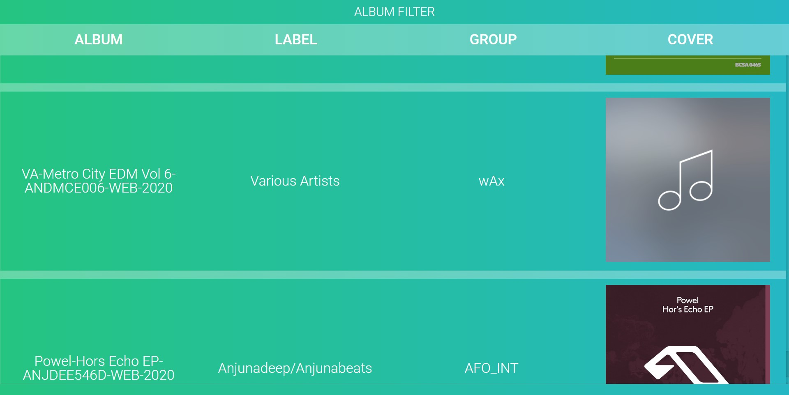
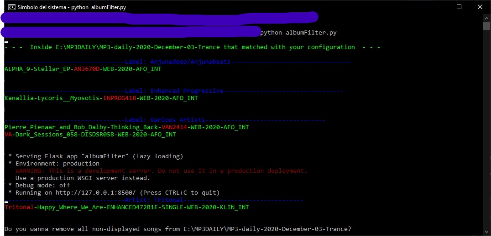

# album-sorter
Python script which sorts/searches for albums from inside a folder

## HOW TO USE
- Put your favorite artists in `artists.txt`, and your favorite labels in `labels.txt`. (e.g. already in there)
- Put the directory `path` in sort folders. (e.g. already in there)    
Structure:  
&nbsp;&nbsp;&nbsp;rootDir/  
&nbsp;&nbsp;├── albumsFolder/  
&nbsp;&nbsp;&nbsp;&nbsp;&nbsp;&nbsp;&nbsp;&nbsp;&nbsp;&nbsp;├─────randomAlbum/  
&nbsp;&nbsp;&nbsp;&nbsp;&nbsp;&nbsp;&nbsp;&nbsp;&nbsp;&nbsp;│&nbsp;&nbsp;&nbsp;&nbsp;&nbsp;&nbsp;&nbsp;&nbsp;&nbsp;&nbsp;&nbsp;&nbsp;&nbsp;├── cover.jpg  
&nbsp;&nbsp;&nbsp;&nbsp;&nbsp;&nbsp;&nbsp;&nbsp;&nbsp;&nbsp;│&nbsp;&nbsp;&nbsp;&nbsp;&nbsp;&nbsp;&nbsp;&nbsp;&nbsp;&nbsp;&nbsp;&nbsp;&nbsp;├── song1.mp3  
&nbsp;&nbsp;&nbsp;&nbsp;&nbsp;&nbsp;&nbsp;&nbsp;&nbsp;&nbsp;│&nbsp;&nbsp;&nbsp;&nbsp;&nbsp;&nbsp;&nbsp;&nbsp;&nbsp;&nbsp;&nbsp;&nbsp;&nbsp;├── song2.mp3  
&nbsp;&nbsp;&nbsp;&nbsp;&nbsp;&nbsp;&nbsp;&nbsp;&nbsp;&nbsp;│&nbsp;&nbsp;&nbsp;&nbsp;&nbsp;&nbsp;&nbsp;&nbsp;&nbsp;&nbsp;&nbsp;&nbsp;&nbsp;└── song3.mp3  
&nbsp;&nbsp;&nbsp;&nbsp;&nbsp;&nbsp;&nbsp;&nbsp;&nbsp;&nbsp;├─────randomAlbum2/  
&nbsp;&nbsp;&nbsp;&nbsp;&nbsp;&nbsp;&nbsp;&nbsp;&nbsp;&nbsp;│&nbsp;&nbsp;&nbsp;&nbsp;&nbsp;&nbsp;&nbsp;&nbsp;&nbsp;&nbsp;&nbsp;&nbsp;&nbsp;├── cover.jpg  
&nbsp;&nbsp;&nbsp;&nbsp;&nbsp;&nbsp;&nbsp;&nbsp;&nbsp;&nbsp;│&nbsp;&nbsp;&nbsp;&nbsp;&nbsp;&nbsp;&nbsp;&nbsp;&nbsp;&nbsp;&nbsp;&nbsp;&nbsp;├── song1.mp3  
&nbsp;&nbsp;&nbsp;&nbsp;&nbsp;&nbsp;&nbsp;&nbsp;&nbsp;&nbsp;│&nbsp;&nbsp;&nbsp;&nbsp;&nbsp;&nbsp;&nbsp;&nbsp;&nbsp;&nbsp;&nbsp;&nbsp;&nbsp;├── song2.mp3  
&nbsp;&nbsp;&nbsp;&nbsp;&nbsp;&nbsp;&nbsp;&nbsp;&nbsp;&nbsp;│&nbsp;&nbsp;&nbsp;&nbsp;&nbsp;&nbsp;&nbsp;&nbsp;&nbsp;&nbsp;&nbsp;&nbsp;&nbsp;└── song3.mp3  
&nbsp;&nbsp;&nbsp;&nbsp;&nbsp;&nbsp;&nbsp;&nbsp;&nbsp;&nbsp;.  
&nbsp;&nbsp;&nbsp;&nbsp;&nbsp;&nbsp;&nbsp;&nbsp;&nbsp;&nbsp;.  
&nbsp;&nbsp;&nbsp;&nbsp;&nbsp;&nbsp;&nbsp;&nbsp;&nbsp;&nbsp;.  
    
  - In the first line of `sortFolders.txt` you need to specify the **rootDir** indicated in the structure above.
  - Then you need to pass all album folders (if you have more that one)
- Run the script. In **Linux**:  `>./albumFilter.py` in **Windows**: `>python albumFilter.py`
- ~~If you use **Windows** please use powershell or you  won't get the correct color formatting, so it will be so confusing.~~ Now you can use any kind of "terminal", including CMD.
- For now, to use the GUI it's a bit confusing but here we go
- The script is gonna iterate all `albumsFolders` that you introduced, for each one, the script is gonna launch a web server which un can access at `localhost:8500`, there you can see info such as album name, release group and cover art.
- When you are done watching, you need to go to the terminal and press `control + c`, and now you will be asked if you want to keep the albums which the script has found, now you need to press `yes` to delete all other albums and keep only listed albums or any other key to keep it all. (At this point the server is down, in other words, after your `control + c` press, the server turns off)
- After that, another server will come up, but this time with a different `albumFolder`, and now you will need to do the same steps as before until the script walks through all your `albumFolders`.
## Demo

